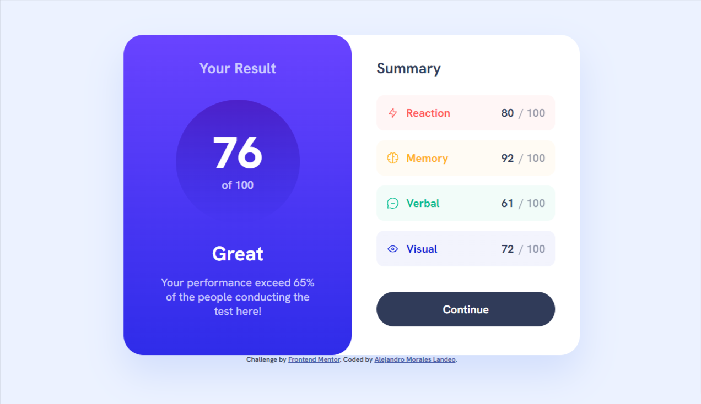
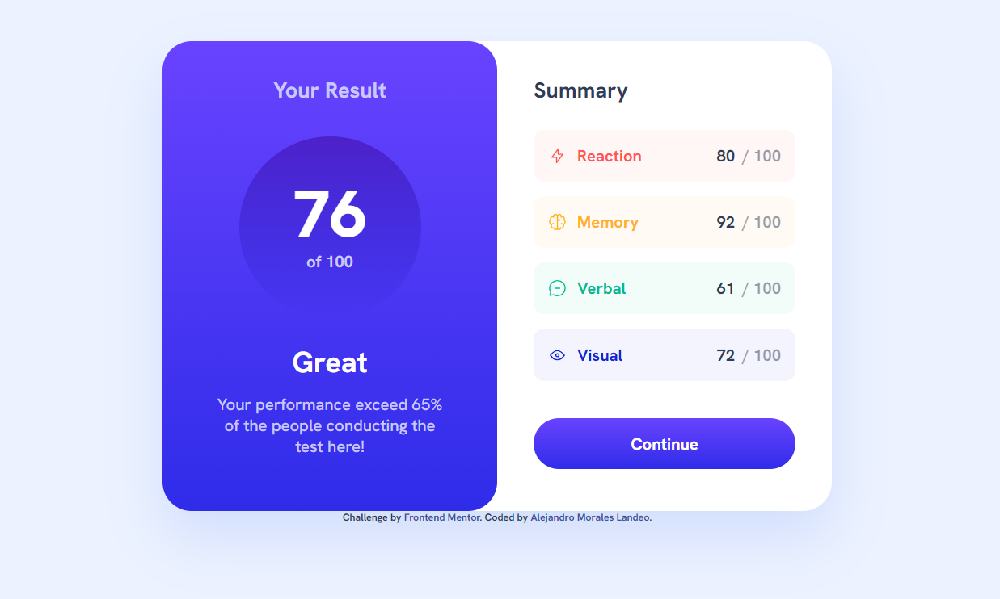
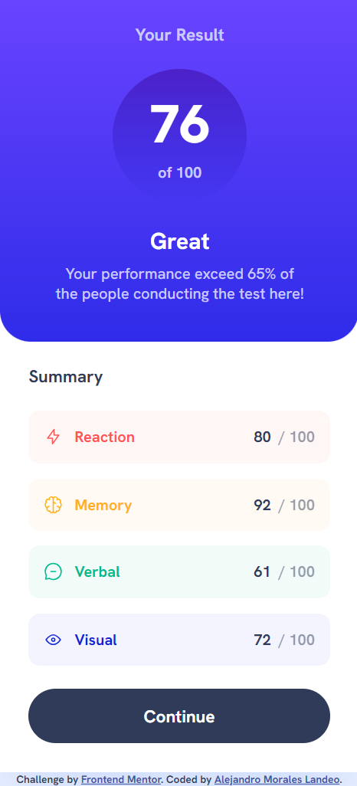

# Frontend Mentor - Results summary component solution

This is a solution to the [Results summary component challenge on Frontend Mentor](https://www.frontendmentor.io/challenges/results-summary-component-CE_K6s0maV). Frontend Mentor challenges help you improve your coding skills by building realistic projects. 

## Table of contents

- [Overview](#overview)
  - [The challenge](#the-challenge)
  - [Screenshot](#screenshot)
  - [Links](#links)
- [My process](#my-process)
  - [Built with](#built-with)
  - [What I learned](#what-i-learned)
- [Author](#author)
- [Acknowledgments](#acknowledgments)


## Overview

### The challenge

Users should be able to:

- View the optimal layout for the interface depending on their device's screen size
- See hover and focus states for all interactive elements on the page
- **Bonus**: Use the local JSON data to dynamically populate the content

### Screenshot
Desktop preview:


Desktop preview (with hover button):


Responsive:


### Links

- Solution URL: [Repository](https://github.com/amoraleslandeo/order-summary-component-figma.github.io)
- Live Site URL: [Web page](https://amoraleslandeo.github.io/order-summary-component-figma.github.io/)

## My process

### Built with

- Semantic HTML5 markup
- CSS custom properties
- Flexbox

### What I learned

I learned this series of codes to calculate the width measurement
```css
margin-left: calc(24px - 32px);
width: calc(100% + 16px); 
```

## Author

- Website - [Alejandro Morales Landeo](https://amoraleslandeo.github.io/personal-page.github.io/)
- Frontend Mentor - [@amoraleslandeo](https://www.frontendmentor.io/profile/amoraleslandeo)


## Acknowledgments

I wanna say thanks to my daily support [Roberto](https://github.com/RobertoSilvaZ) 🙌😉 who has become my developer Mentor and guide through this process that is just beggining.

